# 📋 Dokumentasi Lengkap - Marketplace BUMDes
> Database: `batara` | Framework: Laravel | Payment: Midtrans | Logistik: RajaOngkir

---

## 👥 Use Case Diagram

### UC-01: SuperAdmin

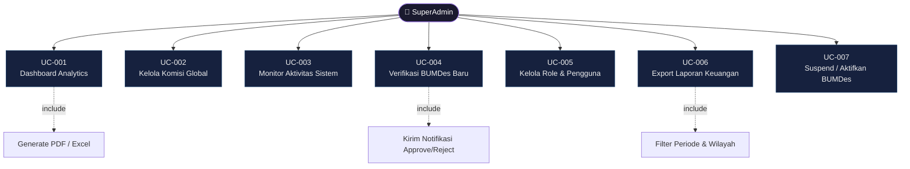

---

### UC-02: BUMDes Admin

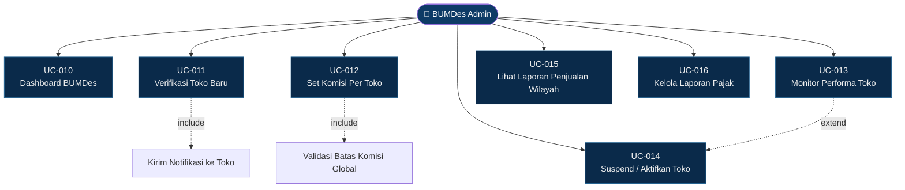

---

### UC-03: Toko Owner

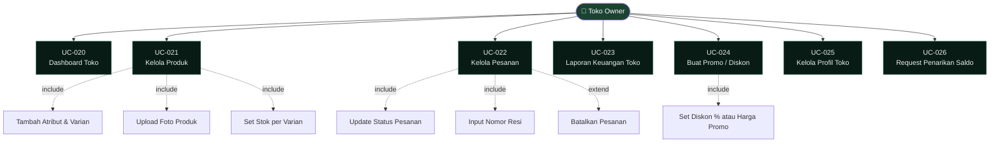

---

### UC-04: Pembeli

```mermaid
graph TD
    PB([👤 Pembeli])

    PB --> UC030[UC-030\nRegistrasi & Login]
    PB --> UC031[UC-031\nCari & Filter Produk]
    PB --> UC032[UC-032\nLihat Detail Produk]
    PB --> UC033[UC-033\nKelola Keranjang]
    PB --> UC034[UC-034\nCheckout Multi-Toko]
    PB --> UC035[UC-035\nLacak Pesanan]
    PB --> UC036[UC-036\nBeri Ulasan & Rating]
    PB --> UC037[UC-037\nKelola Alamat & Profil]
    PB --> UC038[UC-038\nDaftar Keinginan / Wishlist]

    UC031 -. include .-> UC031a[Filter: harga, kategori,\nlokasi BUMDes, rating]
    UC031 -. include .-> UC031b[Sort: terlaris, terbaru, harga]

    UC034 -. include .-> UC034a[Pilih Alamat Pengiriman]
    UC034 -. include .-> UC034b[Hitung Ongkir RajaOngkir]
    UC034 -. include .-> UC034c[Input Voucher Diskon]
    UC034 -. include .-> UC034d[Bayar via Midtrans]

    UC035 -. include .-> UC035a[Track Resi Pengiriman]
    UC035 -. extend .-> UC036

    style PB fill:#4a0e8f,color:#fff
    style UC030 fill:#2d0057,color:#eee,stroke:#7b2ff7
    style UC031 fill:#2d0057,color:#eee,stroke:#7b2ff7
    style UC032 fill:#2d0057,color:#eee,stroke:#7b2ff7
    style UC033 fill:#2d0057,color:#eee,stroke:#7b2ff7
    style UC034 fill:#2d0057,color:#eee,stroke:#7b2ff7
    style UC035 fill:#2d0057,color:#eee,stroke:#7b2ff7
    style UC036 fill:#2d0057,color:#eee,stroke:#7b2ff7
    style UC037 fill:#2d0057,color:#eee,stroke:#7b2ff7
    style UC038 fill:#2d0057,color:#eee,stroke:#7b2ff7
```

---

### UC-05: Flow Bisnis Utama — Checkout & Pembagian Komisi

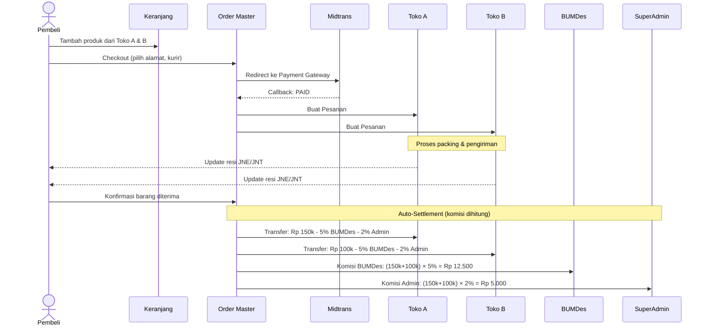

---

## 🗄️ Database Diagram (ERD)

### Diagram 1: Users, Roles & Wilayah

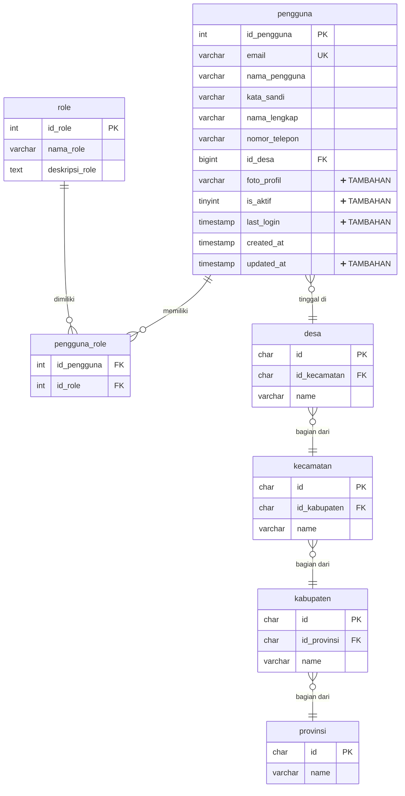

---

### Diagram 2: BUMDes & Toko

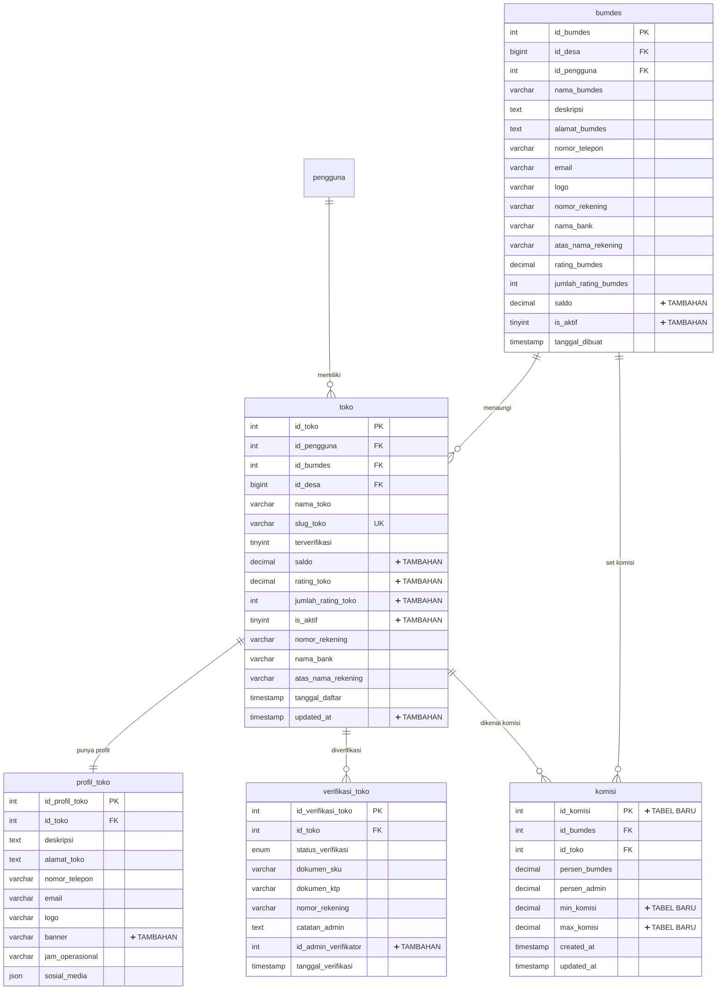

---

### Diagram 3: Produk & Varian

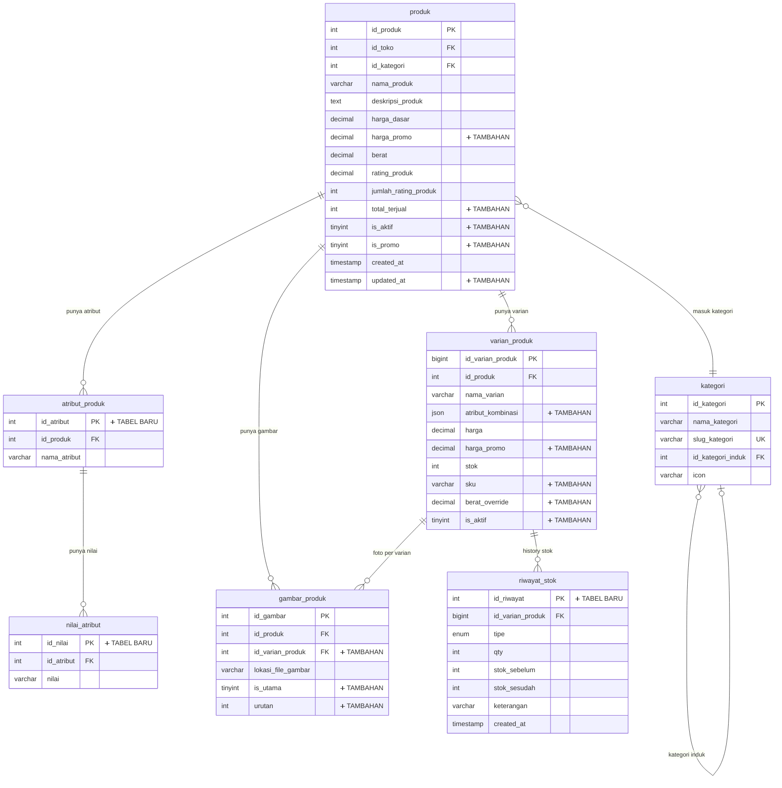

---

### Diagram 4: Keranjang, Order & Pesanan

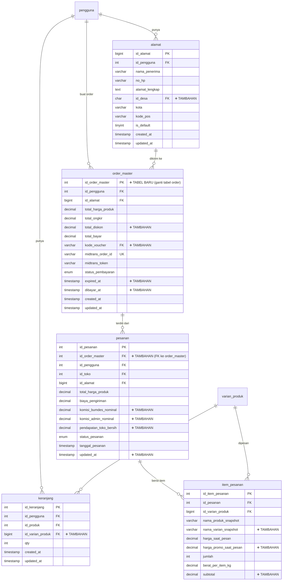

---

### Diagram 5: Pengiriman & Status Pesanan

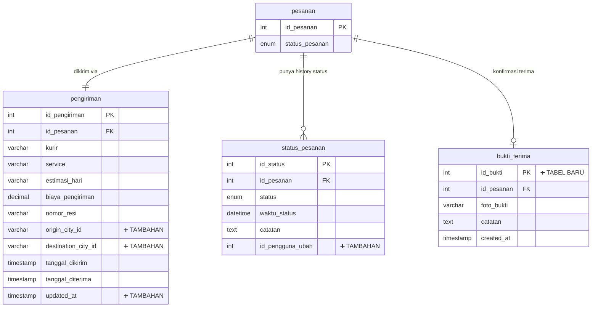

---

### Diagram 6: Komisi, Pendapatan & Penarikan

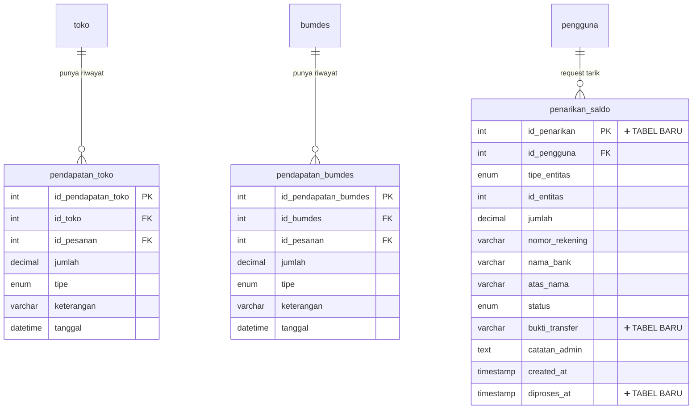

---

### Diagram 7: Ulasan, Notifikasi & Voucher

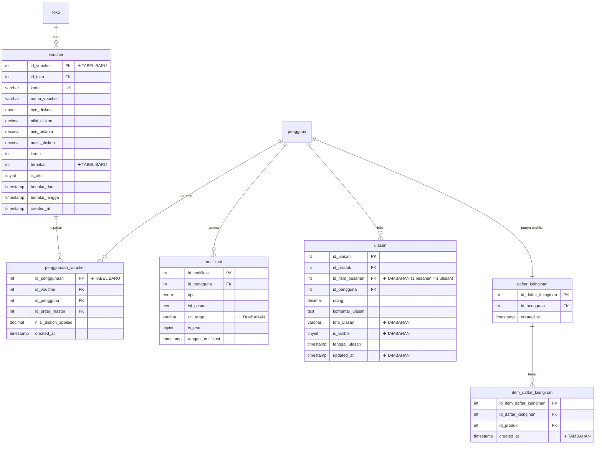

---

## 📊 Ringkasan Penambahan Database

### Tabel Baru yang Perlu Dibuat

| Tabel Baru | Fungsi |
|---|---|
| `komisi` | Menyimpan persen komisi BUMDes & Admin per Toko |
| `order_master` | Pengganti/pelengkap tabel `order` untuk multi-toko |
| `atribut_produk` | Nama atribut produk (Warna, Ukuran, dll) |
| `nilai_atribut` | Nilai dari atribut (Merah, XL, dll) |
| `riwayat_stok` | Audit trail perubahan stok per varian |
| `penarikan_saldo` | Request penarikan saldo oleh Toko/BUMDes |
| `voucher` | Kode voucher diskon per Toko |
| `penggunaan_voucher` | Riwayat penggunaan voucher oleh pembeli |
| `bukti_terima` | Foto bukti penerimaan barang oleh pembeli |

### Kolom Penting yang Perlu Ditambahkan

| Tabel | Kolom Tambahan | Alasan |
|---|---|---|
| `pengguna` | `foto_profil`, `is_aktif`, `last_login`, `updated_at` | Profil lengkap & monitoring |
| `toko` | `saldo`, `rating_toko`, `is_aktif`, `updated_at` | Keuangan & status toko |
| `produk` | `harga_promo`, `total_terjual`, `is_aktif`, `updated_at` | Promo & analytics |
| `varian_produk` | `sku`, `atribut_kombinasi`, `harga_promo`, `is_aktif` | Varian lengkap |
| `pesanan` | `id_order_master`, `komisi_bumdes_nominal`, `komisi_admin_nominal` | Tracking komisi per pesanan |
| `keranjang` | `id_varian_produk` | Keranjang harus ke varian, bukan produk |
| `alamat` | `id_desa` | Untuk kalkulasi ongkir RajaOngkir |
| `ulasan` | `id_item_pesanan`, `foto_ulasan` | Satu ulasan per item |
| `gambar_produk` | `id_varian_produk`, `is_utama`, `urutan` | Foto per varian |
| `bumdes` | `saldo`, `is_aktif` | Keuangan BUMDes |

---

> **Catatan:** Kolom bertanda `➕ TAMBAHAN` adalah kolom yang belum ada di database saat ini namun **wajib ada** untuk mendukung fitur-fitur di use case. Tabel bertanda `➕ TABEL BARU` adalah tabel yang perlu dibuat dari awal.
